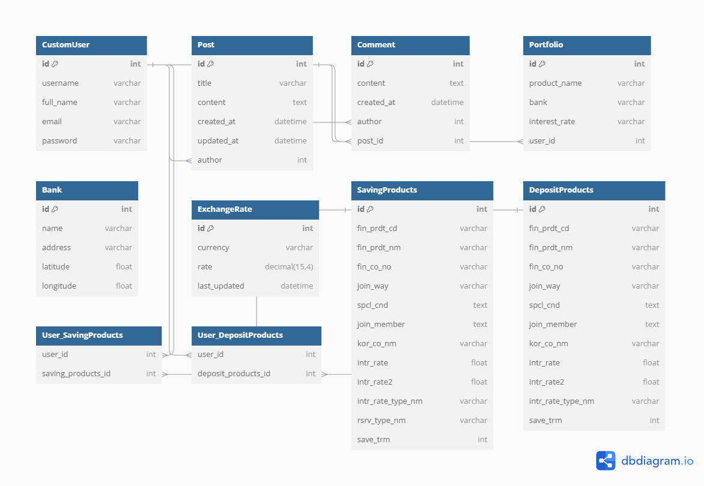

# 종합 프로젝트

## 프로젝트 결과

### 1. 팀

* 프로젝트 진행 날짜 : 2024.11.18-2024.11.26

* 역할 분담

    | 팀원   | 업무 내용                                                    |      |
    | ------ | ------------------------------------------------------------ | ---- |
    | 문상혁(팀장) | 1. ERD 모델구성, 디자인, 계정 기능, 커뮤니티, 금융 상품 추천, 포토폴리오 |      |
    | 김태원(팀원) | 1. ERD 모델구성, 디자인, 예적금 상품 비교(전체 조회, 상세조회), 근처 은행 검색, 환율계산기 |      |


### 2. ERD



### 3. 기능
#### A. 회원가입 / 로그인 / 로그아웃

1) 회원가입


* 입력한 정보(이름, 이메일)가 이미 가입되어 있을 경우 회원 가입 불가

  

2) 로그인


* 입력한 정보가 올바르지 않을 경우 아이디 또는 비밀번호가 잘못되었습니다 경고창으로 피드백 제공

* JWT 활용

* 로그인 시 로그인한 사용자 정보를 store에 저장

  

3) 로그아웃

* 로그아웃 시 store에 저장된 사용자 정보 초기화


#### B. 예적금 상품 비교

1) 예금 상품 비교

* 로그인하지 않은 일반 사용자도 조회 가능
* 상품명, 기본 이자율, 최고 우대 이자율, 가입 기간 상품 카드로 나열
* 은행 선택 칸을 만들어서 사용자가 원하는 은행으로 필터링 가능


2) 상세 보기

* 상품 각각의 상세 보기 버튼 클릭 시 상품의 상세 설명(기본 이자율, 최고 우대 이자율, 가입 방법, 우대 조건 등등)
* 평소 가입이 되어있거나 가입할 의향이 있는 상품 가입 하기 버튼 클릭


#### C. 주변 은행 검색

1) 위치 입력


* 로그인하지 않은 일반 사용자도 사용 가능

* 현재 자신의 위치 혹은 사용자가 원하는 위치 검색(도로명, 건물명 모두 가능)

* 위치 검색 시 검색 리스트를 표현


2) 지도 표시 및 은행명, 주소 나열

* 검색을 통해 선택된 장소 기준 반경 5km안에 있는 은행들 좌표로 표시

* 지도 기준 오른쪽에 주변 은행 은행명, 주소 나열

* 좌표 클릭 시 선택된 은행 은행명, 주소 표시

* 지도 확대, 축소 가능


#### D. 환율 계산기


1) 환율계산기

* 통화 선택을 통해 현재 사용자가 변환 시킬 통화를 선택

* 금액 입력 : 금액 입력을 통해 본인이 선택한 통화의 금액 직접 입력

* 변환할 통화 : 사용자가 선택한 통화를 변환할 통화를 선택

* 변환된 금액 자동 계산 후 표시
  

2) 현재 환율 상태

* 통화 선택 및 변환할 통화 항목에 있는 통화들을 원화 기준으로 변환 금액을 표로 작성하여 환율 계산기 기준 오른쪽에 표시


#### E. 커뮤니티 


1) 게시글 목록

* 로그인 상태에서만 게시글 목록이 보일 수 있도록 설계

* 로그인 상태라면 게시글 목록 나열


2) 게시글 작성

* 게시글 작성 버튼을 누를 시 게시글 작성 페이지로 이동

* 게시글 제목, 게시글 내용 작성 후 게시글 작성 버튼 누를 시 게시글 게재


3) 게시글 수정

* 게시글 목록에서도 본인이 작성한 게시글 한에서 게시글 수정, 삭제 버튼 활성화

* 게시글 수정 버튼 누를 시 게시글 수정 페이지로 이동

* 게시글 제목 및 내용 변경 후 수정 버튼 누를 시 게시글 변경

4) 게시글 삭제

* 게시글 목록에서도 본인이 작성한 게시글 한에서 게시글 수정, 삭제 버튼 활성화

* 게시글 삭제 버튼 누를 시 게시글 삭제
  
5) 게시글 상세 페이지

* 게시글 제목 클릭 시 게시글 상세 페이지로 이동

* 게시글 제목, 내용, 작성 날짜 확인
  


#### F. 금융상품 추천

* 가입 목적 : 금융 상품의 가입 목적을 사용자의 시나리오(목적)에 맞게 선택

* 저축 기간 : 사용자가 원하는 저축 기간 선택

* 은행 : 사용자가 선호하는 은행 선택

* 최소 이자율, 최대 이자율 : 사용자가 원하는 최소 이자율, 최대 이자율 입력

* 위의 항목들을 AI에게 메세지로 전달 GPT-3.5 모델로 질문

* 답변을 AI 추천 : 나열

* 포토폴리오 저장 시 AI가 추천한 상품을 포토폴리오에 저장

* 로그인 시 포토폴리오에 저장 버튼 클릭 시 내 포트폴리오에 저장


#### G. MY Page

1) 기본 정보

* 로그인 한 사용자의 이름, 이메일 표시

* 정보 수정 버튼 클릭 시 정보 수정 칸 활성화

* 이름, 이메일 수정 후 저장 클릭 시 해당 사항 수정

2) 금리 차트

* 사용자가 예적금 상품 비교에서 가입한 상품들의 기본금리, 우대금리를 차트로 표현 (x축 상품명, y축 금리%)

3) 포토폴리오

* 사용자가 금융 상품 추천에서 저장한 포토폴리오를 볼 수 있는 포토폴리오 저장 페이지로 이동 버튼 활성화


#### H. 내 포트폴리오
* 금융 상품 추천에서 저장한 상품이 나열

* 상품명(은행명 / 최소이자율-최대이자율% ) 나열

* 삭제 버튼 클릭 시 저장한 상품 포트폴리오에서 삭제


### 4. 느낀 점

* 평소 기본기가 부족한 멤버들이 모여서 걱정을 하였지만 단기간 1학기 동안 배웠던 항목들의 대한 복습 및 공부, 성장이 이루어진 것을 느꼈다. 
* 주간 일정을 제외하고도 야간, 주말에 온라인으로 진행했기에 소통에 어려움을 겪진 않을까 우려되었지만, 여러가지 협업 툴을 활용해 빠르고 정확한 의사소통이 가능했다. Webex, Discord 를 활용하였다. 
* 팀워크가 잘 맞아서 정해진 시간 내에 계획했던 필수 기능들을 모두 구현할 수 있었다.
* 전반적인 흐름과 코드 작성 등을 모두 경험하기 위해서 프론트엔드와 백엔드를 정확하게 나누기보단, 기능 별로 역할을 나누었다. 하지만 막상 하루에 계획했던 기능들을 소화하기 생각보다 어려웠다.
* 그러다 보니 처음 계획하고 담당하던 기능들에서 조금은 유동적으로 본인이 담당할 기능들을 변경하였다.
* 서로가 완성 기능들을 시험, 평가하며 디버깅을 시도하였고 어디서 에러가 나며 에러를 디버그하기 위한 방법 또한 고민해가며 풀스택의 능력을 키우려고하였다.
* 진행함에 있어서 페어와의 소통이 굉장히 중요함을 느끼게 되었다.


## 개발환경

### 1. 개발 환경

#### A. 언어

* Python 3.9.13
* Django 4.2.16
* Node v22.11.0
* Vue.js @vue/cli 5.0.8


#### B. 도구

* vsCode
* Chrome Browser


#### C. 아키텍쳐

* Django REST API 서버 & Vue.js


### 2. 환경 추가 설정

**필수** 사전 생성 파일

* `.env` 

  * 생성 경로 : SSafy_Final/.env


  ```
  API_KEY=금융 상품 api 키
  OPENAI_API_KEY= openai_api 키
  VITE_KAKAO_MAP_API_KEY= 지도를 불러오기 위한 카카오 api키
  FOREX_API_KEY=환율 api 키
  VITE_OPENAI_API_KEY= vite에서 쓰기위한 openai_api키
  ```


  


----


